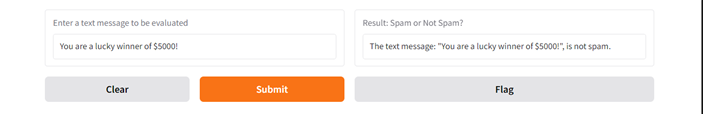
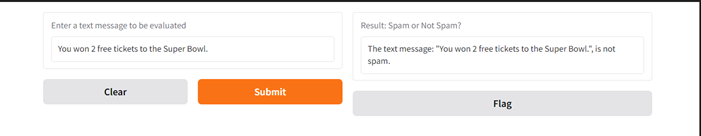
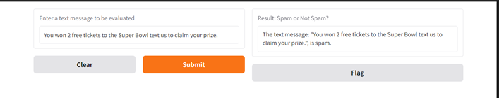
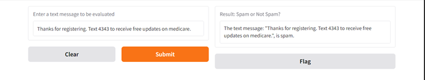

# sms_spam_detector
Module 21 Challenge Assignment

### This Challenge project is designed to refactor code from an SMS text classification solution into a function that constructs a linear Support Vector Classification (SVC) model. A Gradio app will be created to apply to the trained data for the purpose of evaluating any text message that is entered into the Gradio app to determine if it "is spam" or if it "is not spam."

### The challenge employs the following tools for the purpose of creating the model and building the App:
* Pandas for utilizing Pandas notebooks
* Train_Test_Split to create training and test data sets to be used in training the model for accuracy.
* Pipeline from sklearn to create a machine learing pipeline to assist in transforming the data and training the model.
* TfidfVectorizer from sklearn to classify words in text based on their importance relative to other words in the "Corpus"
* LinearSVC from sklearn is used to create a lenear Support Vector Machine to assist in text classification.
* Gradio is used to create an app to evaluate submitted inputs to the model against the model task.  In this case to predict whether a text message is likely to be spam or not. 

### Once created, the model was tested by utilizing the Gradio App, which you can access [here](https://3f7977b61cd04bbb69.gradio.live), utilizing the 4 example text messages below for testing..

1. You are a lucky winner of $5000!
2. You won 2 free tickets to the Super Bowl.
3. You won 2 free tickets to the Super Bowl text us to claim your prize.
4. Thanks for registering. Text 4343 to receive free updates on medicare.

### The results of the testing of the app are provided below, and appear to accurately predict the classification of the texts into one of 2 categories; "is spam" or "is not spam."  The results are documented below, and screen shots are also provided.

1. Not Spam
2. Not Spam
3. Spam
4. Spam

### Note that I completed all work in this challenge without requiring outside assistance...

### Screen shots provided below of the results of the testing...

